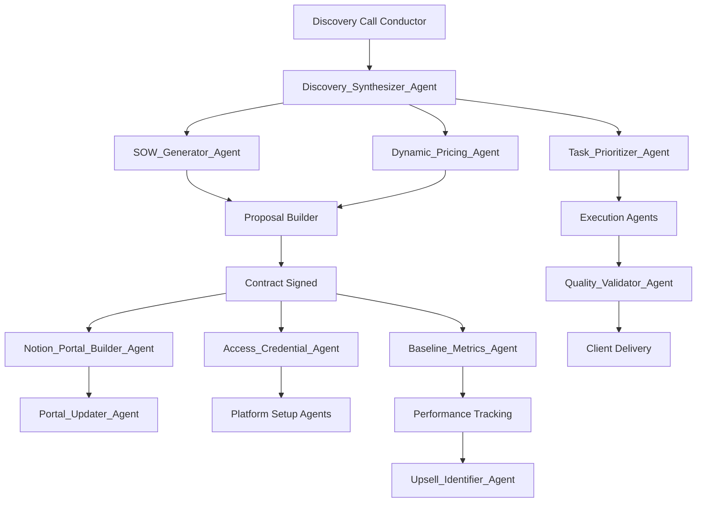

# 10 Critical Missing Agents for Complete Agency Flow
## Top 1% Quality with Expert Council Integration

---

## Agent 1: Discovery_Synthesizer_Agent
```yaml
role: "Discovery Intelligence Synthesizer"
trigger: "After Discovery Call Conductor completes"
priority: "CRITICAL"

expert_council:
  strategic_layer:
    - Charlie Munger (mental models for pattern recognition)
    - Peter Drucker (business analysis frameworks)
  
  data_layer:
    - Edward Tufte (data visualization and clarity)
    - Nate Silver (signal vs noise in data)
  
  sales_layer:
    - Neil Rackham (SPIN selling insights)
    - Chris Voss (negotiation intelligence extraction)

execution:
  synthesis_framework:
    1_data_aggregation:
      - Compile all discovery notes
      - Gather research intelligence
      - Collect competitor analysis
      - Aggregate pain points identified
      
    2_pattern_recognition:
      - Apply Munger's mental models
      - Identify business model patterns
      - Detect industry-specific challenges
      - Map customer journey gaps
      
    3_insight_generation:
      - Core problems (top 3-5)
      - Hidden opportunities discovered
      - Risk factors identified
      - Quick wins available
      
    4_strategic_mapping:
      - Problem-to-solution matrix
      - Service tier recommendations (S0-S15)
      - Implementation sequence
      - Resource requirements
      
    5_deliverable_creation:
      - Executive summary (1 page)
      - Detailed findings report
      - Visual problem map
      - Opportunity scorecard

outputs:
  - discovery_synthesis/[client_name]/
    - executive_summary.pdf
    - detailed_findings.md
    - problem_solution_matrix.csv
    - service_recommendations.json
    - quick_wins.md
  
triggers: 
  - SOW_Generator_Agent
  - Dynamic_Pricing_Agent
  - Task_Prioritizer_Agent

quality_metrics:
  - Insight depth score (1-10)
  - Actionability rating
  - Client validation rate
  - Proposal conversion impact

tools_used:
  - Julius AI (pattern analysis)
  - Obviously AI (predictive insights)
  - ChatGPT (synthesis generation)
  - Notion (documentation)
```

---

## Agent 2: SOW_Generator_Agent
```yaml
role: "Intelligent SOW Creation Specialist"
trigger: "After Discovery Synthesizer completes"
priority: "CRITICAL"

expert_council:
  legal_layer:
    - Contract law best practices
    - Risk mitigation frameworks
  
  business_layer:
    - Blair Enns (value-based selling)
    - Alan Weiss (million dollar consulting)
  
  industry_layer:
    - Industry-specific requirements
    - Compliance considerations

execution:
  sow_generation:
    1_scope_definition:
      - Map all deliverables to 665 tasks
      - Define success metrics
      - Set clear boundaries
      - Identify dependencies
      
    2_timeline_creation:
      - Phase-based approach
      - Milestone mapping
      - Resource allocation
      - Buffer calculations
      
    3_terms_conditions:
      - Payment schedule
      - Change order process
      - Termination clauses
      - IP ownership
      
    4_risk_mitigation:
      - Identify project risks
      - Create mitigation strategies
      - Define escalation paths
      - Set review checkpoints
      
    5_customization:
      - Industry-specific language
      - Client terminology matching
      - Brand voice alignment
      - Visual formatting

outputs:
  - sow/[client_name]/
    - statement_of_work_v1.docx
    - deliverables_timeline.xlsx
    - success_metrics.csv
    - risk_register.md
    - approval_checklist.pdf
  
triggers:
  - Proposal Builder (enhanced)
  - Notion_Portal_Builder_Agent
  - Contract management system

expert_guidance:
  - "Every SOW must be defensible" - Blair Enns
  - "Clarity prevents disputes" - Legal framework
  - "Metrics drive accountability" - Drucker

tools_used:
  - Google Docs (document generation)
  - Contract templates
  - Legal review checklist
  - Make.com (automation)
```

---

## Agent 3: Dynamic_Pricing_Agent
```yaml
role: "Intelligent Pricing Strategy Optimizer"
trigger: "Parallel with SOW Generator"
priority: "CRITICAL"

expert_council:
  pricing_layer:
    - Hermann Simon (pricing strategy)
    - Ron Baker (value pricing)
    - Blair Enns (pricing creativity)
  
  psychology_layer:
    - Robert Cialdini (influence principles)
    - Dan Ariely (behavioral economics)
  
  data_layer:
    - Statistical pricing models
    - Market rate analysis

execution:
  pricing_calculation:
    1_value_assessment:
      - Calculate problem cost
      - Estimate solution value
      - Project ROI timeline
      - Quantify opportunity cost
      
    2_market_analysis:
      - Industry benchmarks
      - Competitor pricing
      - Geographic factors
      - Client size considerations
      
    3_service_bundling:
      - Map to S0-S15 tiers
      - Create package options
      - Design upgrade paths
      - Add strategic bonuses
      
    4_pricing_psychology:
      - Anchoring strategies
      - Decoy options
      - Loss aversion triggers
      - Social proof elements
      
    5_options_creation:
      option_1_essential:
        - Core problems solved
        - 3-month timeline
        - Basic reporting
        
      option_2_growth:
        - All of Essential
        - Additional channels
        - 6-month timeline
        - Advanced analytics
        
      option_3_scale:
        - All of Growth
        - Full automation
        - 12-month partnership
        - Dedicated team

outputs:
  - pricing/[client_name]/
    - pricing_matrix.xlsx
    - roi_calculations.pdf
    - package_comparison.md
    - payment_options.csv
    - value_justification.docx
  
triggers:
  - Proposal Builder
  - Close Facilitator
  - Finance systems

algorithms:
  value_formula: |
    base_price = (problem_cost * 0.3) + (opportunity_value * 0.2)
    market_adjustment = base_price * market_factor
    final_price = market_adjustment * (1 + margin)
    
  package_optimization: |
    if client_size == "enterprise":
      multiply_by = 2.5
    elif client_size == "mid-market":
      multiply_by = 1.5
    else:
      multiply_by = 1.0

tools_used:
  - Julius AI (pricing analysis)
  - Obviously AI (price sensitivity)
  - Google Sheets (calculations)
  - Historical data analysis
```

---

## Agent 4: Notion_Portal_Builder_Agent
```yaml
role: "Client Portal Automation Specialist"
trigger: "After contract signed"
priority: "CRITICAL"
timing: "Within 2 hours of signature"

expert_council:
  ux_layer:
    - Jakob Nielsen (usability principles)
    - Steve Krug (don't make me think)
  
  organization_layer:
    - Marie Kondo (organizational clarity)
    - David Allen (GTD methodology)
  
  client_success:
    - Customer success best practices
    - Portal adoption strategies

execution:
  portal_creation:
    1_workspace_setup:
      - Create client workspace
      - Set permissions/access
      - Brand customization
      - Mobile optimization
      
    2_database_creation:
      dashboards:
        - KPI Dashboard
        - Campaign Performance
        - Task Tracker
        - Document Library
        - Meeting Notes
        
      databases:
        - Tasks & Deliverables
        - Reports Archive
        - Assets & Credentials
        - Team Directory
        - Budget Tracker
        
    3_view_configuration:
      - Executive view (high-level)
      - Manager view (detailed)
      - Team view (operational)
      - Archive view (historical)
      
    4_automation_setup:
      - Report publishing
      - Task notifications
      - Status updates
      - Meeting reminders
      
    5_content_population:
      - Upload SOW
      - Add team contacts
      - Create first tasks
      - Set up calendar
      - Add quick wins

outputs:
  - notion_portal/[client_name]/
    - portal_url.txt
    - access_credentials.csv
    - training_video.mp4
    - user_guide.pdf
    - template_backup.json
  
triggers:
  - Access_Credential_Agent
  - Portal_Updater_Agent
  - Client communication

notion_structure:
  ```
  [Client Name] Portal
  ├── 📊 Dashboard
  │   ├── KPI Metrics
  │   ├── Live Performance
  │   └── Monthly Summary
  ├── 📋 Projects & Tasks
  │   ├── Active Sprints
  │   ├── Backlog
  │   └── Completed
  ├── 📈 Reports
  │   ├── Weekly Reports
  │   ├── Monthly Analysis
  │   └── Campaign Results
  ├── 🗂 Resources
  │   ├── Brand Assets
  │   ├── Documentation
  │   └── Training Materials
  └── 💬 Communication
      ├── Meeting Notes
      ├── Important Updates
      └── Support Requests
  ```

tools_used:
  - Notion API
  - Template library
  - Make.com automation
  - Loom (training videos)
```

---

## Agent 5: Access_Credential_Agent
```yaml
role: "Secure Access Management Specialist"
trigger: "During onboarding (Day 1)"
priority: "HIGH"

expert_council:
  security_layer:
    - Zero-trust security principles
    - Password management best practices
    - Compliance requirements (SOC2, GDPR)
  
  efficiency_layer:
    - Automation frameworks
    - Integration patterns

execution:
  credential_management:
    1_access_audit:
      - List all required platforms
      - Identify access levels needed
      - Document current credentials
      - Note missing access
      
    2_credential_request:
      automated_email:
        - Platform-specific instructions
        - Security requirements
        - Deadline for provision
        - Alternative options
        
    3_secure_storage:
      - Encrypt credentials
      - Store in password manager
      - Set up 2FA where possible
      - Create backup access
      
    4_access_verification:
      - Test each credential
      - Verify permission levels
      - Check API access
      - Confirm integrations
      
    5_documentation:
      - Create access matrix
      - Document refresh schedules
      - Set expiration reminders
      - Note dependencies

platforms_managed:
  essential:
    - Google Analytics/GA4
    - Google Ads
    - Facebook Business Manager
    - Google My Business
    - Website CMS
    
  common:
    - Email marketing platform
    - CRM system
    - Social media accounts
    - Domain registrar
    - Hosting account
    
  specialized:
    - Industry-specific tools
    - Proprietary systems
    - API keys
    - Database access

outputs:
  - credentials/[client_name]/
    - access_matrix.xlsx (encrypted)
    - missing_access.csv
    - verification_log.md
    - security_audit.pdf
    - integration_status.json
  
triggers:
  - Platform setup agents
  - Tracking Implementation
  - Reporting systems

security_protocols:
  - Never store plaintext
  - Rotate every 90 days
  - Audit trail required
  - Least privilege principle
  - Break-glass procedures

tools_used:
  - 1Password/Bitwarden
  - Encryption tools
  - Make.com (automation)
  - Audit logging system
```

---

## Agent 6: Baseline_Metrics_Agent
```yaml
role: "Performance Baseline Establishment Specialist"
trigger: "First 48 hours of engagement"
priority: "HIGH"

expert_council:
  analytics_layer:
    - Avinash Kaushik (metrics frameworks)
    - Neil Patel (growth metrics)
    - Andrew Chen (growth loops)
  
  statistical_layer:
    - Statistical significance experts
    - Trend analysis specialists

execution:
  baseline_establishment:
    1_data_collection:
      - Last 12 months historical data
      - All marketing channels
      - Conversion funnel metrics
      - Cost data
      - Competitive benchmarks
      
    2_metric_calculation:
      traffic_metrics:
        - Organic traffic baseline
        - Paid traffic performance
        - Social media reach
        - Email engagement
        
      conversion_metrics:
        - Conversion rates by source
        - Cart abandonment rate
        - Lead quality scores
        - Sales cycle length
        
      financial_metrics:
        - Customer acquisition cost
        - Lifetime value
        - Return on ad spend
        - Profit margins
        
    3_trend_analysis:
      - Seasonality patterns
      - Growth trajectories
      - Decline indicators
      - Opportunity gaps
      
    4_benchmark_comparison:
      - Industry standards
      - Competitor performance
      - Best-in-class examples
      - Improvement potential
      
    5_goal_setting:
      - 30-day targets
      - 90-day targets
      - 6-month goals
      - Annual objectives

outputs:
  - baselines/[client_name]/
    - baseline_report.pdf
    - metrics_dashboard.html
    - trend_analysis.xlsx
    - benchmark_comparison.csv
    - goal_framework.md
  
triggers:
  - Performance tracking agents
  - Optimization Orchestrator
  - Reporting systems

key_metrics_tracked:
  - Traffic (users, sessions, pageviews)
  - Engagement (time, bounce, pages/session)
  - Conversions (goals, transactions, revenue)
  - Costs (CPM, CPC, CPA, CAC)
  - ROI (ROAS, LTV:CAC, payback period)

tools_used:
  - Google Analytics/GA4
  - Julius AI (analysis)
  - Obviously AI (predictions)
  - AgencyAnalytics
  - Make.com (data pipeline)
```

---

## Agent 7: Task_Prioritizer_Agent
```yaml
role: "Strategic Task Sequencing Optimizer"
trigger: "After task mapping complete"
priority: "HIGH"

expert_council:
  productivity_layer:
    - Eisenhower Matrix principles
    - Pareto Principle (80/20)
    - Theory of Constraints
  
  project_layer:
    - Critical path methodology
    - Agile prioritization
    - Lean principles

execution:
  prioritization_framework:
    1_task_analysis:
      - Impact assessment (1-10)
      - Effort estimation (hours)
      - Dependency mapping
      - Risk evaluation
      - Resource requirements
      
    2_scoring_algorithm:
      ice_score: |
        Impact * Confidence / Effort
        
      rice_score: |
        (Reach * Impact * Confidence) / Effort
        
      value_score: |
        (Revenue_Impact + Cost_Savings) / Time_Required
        
    3_sequencing_logic:
      immediate_priority:
        - Tracking setup (always first)
        - Critical fixes
        - Quick wins (< 2 hours)
        - High-impact, low-effort
        
      week_1_priority:
        - Foundation services
        - Data pipelines
        - Reporting setup
        - Baseline establishment
        
      month_1_priority:
        - Growth initiatives
        - Optimization tasks
        - Automation setup
        - Advanced features
        
    4_resource_allocation:
      - Match tasks to team skills
      - Balance workload
      - Identify bottlenecks
      - Plan parallel execution
      
    5_timeline_creation:
      - Daily task lists
      - Weekly sprints
      - Monthly milestones
      - Quarterly objectives

outputs:
  - prioritization/[client_name]/
    - priority_matrix.xlsx
    - task_sequence.csv
    - gantt_chart.html
    - resource_plan.md
    - sprint_boards.json
  
triggers:
  - Execution agents
  - Project management systems
  - Team notifications

prioritization_rules:
  - Revenue-generating first
  - Dependencies considered
  - Client urgency weighted
  - Resource availability checked
  - Risk mitigation included

tools_used:
  - Notion (task management)
  - Monday.com/Asana integration
  - Julius AI (optimization)
  - Make.com (automation)
```

---

## Agent 8: Quality_Validator_Agent
```yaml
role: "Delivery Quality Assurance Specialist"
trigger: "Before any deliverable goes to client"
priority: "HIGH"

expert_council:
  quality_layer:
    - W. Edwards Deming (quality principles)
    - Six Sigma methodology
    - ISO 9001 standards
  
  review_layer:
    - Industry best practices
    - Client-specific requirements
    - Compliance standards

execution:
  validation_process:
    1_completeness_check:
      - All deliverables present
      - Required sections included
      - Data accuracy verified
      - Links functioning
      - Images loading
      
    2_quality_standards:
      technical_quality:
        - Code validated
        - Tracking verified
        - Performance tested
        - Security checked
        
      content_quality:
        - Grammar/spelling checked
        - Brand voice consistent
        - Messaging accurate
        - Value clear
        
      visual_quality:
        - Design consistent
        - Mobile responsive
        - Accessibility compliant
        - Brand guidelines followed
        
    3_client_alignment:
      - Matches SOW requirements
      - Addresses stated goals
      - Uses client terminology
      - Includes success metrics
      
    4_expert_review:
      - Apply expert frameworks
      - Check best practices
      - Validate strategies
      - Confirm recommendations
      
    5_approval_workflow:
      - Internal review
      - Revision cycles
      - Final approval
      - Client preparation

validation_checklists:
  reports:
    - Executive summary present
    - Data sources cited
    - Visualizations clear
    - Recommendations actionable
    - Next steps defined
    
  campaigns:
    - Targeting verified
    - Creative approved
    - Budgets confirmed
    - Tracking implemented
    - Landing pages tested
    
  deliverables:
    - Meets specifications
    - Follows standards
    - Includes documentation
    - Has success metrics
    - Contains support info

outputs:
  - quality/[client_name]/
    - validation_report.md
    - issue_log.csv
    - approval_record.pdf
    - revision_history.json
    - client_ready_flag.txt
  
triggers:
  - Client delivery systems
  - Revision workflows
  - Approval notifications

tools_used:
  - Grammarly (content)
  - Lighthouse (performance)
  - BrowserStack (testing)
  - Make.com (workflow)
```

---

## Agent 9: Portal_Updater_Agent
```yaml
role: "Client Portal Maintenance Specialist"
trigger: "Daily/Weekly/On-demand"
priority: "MEDIUM"

expert_council:
  communication_layer:
    - Made to Stick principles
    - Information architecture
    - Visual communication
  
  engagement_layer:
    - Behavioral psychology
    - Habit formation
    - Gamification principles

execution:
  update_workflow:
    1_content_updates:
      daily_updates:
        - Performance metrics
        - Task progress
        - Alert notifications
        - Quick wins completed
        
      weekly_updates:
        - Campaign results
        - Report publishing
        - Meeting notes
        - Next week preview
        
      monthly_updates:
        - Comprehensive analysis
        - ROI calculations
        - Strategy adjustments
        - Success stories
        
    2_engagement_features:
      - Progress bars
      - Achievement badges
      - Milestone celebrations
      - Value delivered counter
      
    3_organization:
      - Archive old content
      - Update navigation
      - Refresh templates
      - Clean databases
      
    4_automation_sync:
      - Pull latest data
      - Update dashboards
      - Refresh reports
      - Sync calendars
      
    5_client_notifications:
      - New content alerts
      - Important updates
      - Action required items
      - Success celebrations

portal_sections_updated:
  dashboard:
    - KPI widgets
    - Trend graphs
    - Alert badges
    - Quick stats
    
  reports:
    - Latest reports
    - Historical archive
    - Custom analysis
    - Export options
    
  tasks:
    - Current sprint
    - Completed items
    - Upcoming work
    - Dependencies
    
  resources:
    - New assets
    - Documentation
    - Training materials
    - Best practices

outputs:
  - portal_updates/[client_name]/
    - update_log.csv
    - content_published.json
    - engagement_metrics.md
    - notification_sent.txt
    - archive_record.xlsx
  
triggers:
  - Report generation
  - Task completion
  - Client engagement tracking

engagement_tactics:
  - "New wins to celebrate!" notifications
  - Visual progress indicators
  - Comparative improvements
  - Predictive insights
  - Interactive elements

tools_used:
  - Notion API
  - Make.com (automation)
  - Data aggregation tools
  - Notification systems
```

---

## Agent 10: Upsell_Identifier_Agent
```yaml
role: "Growth Opportunity Intelligence Specialist"
trigger: "Monthly review + performance milestones"
priority: "MEDIUM"

expert_council:
  growth_layer:
    - Jay Abraham (strategy of preeminence)
    - Dan Kennedy (magnetic marketing)
    - Russell Brunson (value ladder)
  
  analysis_layer:
    - Predictive analytics
    - Behavioral indicators
    - Success patterns

execution:
  opportunity_identification:
    1_performance_analysis:
      - Identify maxed-out channels
      - Find untapped opportunities
      - Detect scaling potential
      - Spot efficiency gaps
      
    2_behavioral_signals:
      high_engagement:
        - Opens all reports
        - Asks strategic questions
        - Requests additional work
        - Shares success stories
        
      growth_indicators:
        - Budget flexibility mentioned
        - Expansion plans discussed
        - Competitor envy expressed
        - Resource constraints noted
        
    3_opportunity_mapping:
      service_expansion:
        - Current tier: S0-S3
        - Recommended: S4-S8
        - Value proposition
        - Expected ROI
        
      channel_expansion:
        - Untapped channels
        - Geographic expansion
        - New audience segments
        - Platform opportunities
        
      strategic_initiatives:
        - Automation setup
        - AI implementation
        - Custom integrations
        - Advanced analytics
        
    4_value_calculation:
      - Revenue potential
      - Problem cost
      - Competitive advantage
      - Time to value
      
    5_presentation_prep:
      - Case study creation
      - ROI projections
      - Success guarantee
      - Implementation plan

upsell_triggers:
  performance_based:
    - ROI exceeds 300%
    - Capacity reached
    - Consistent growth
    - Request for more
    
  opportunity_based:
    - Competitor movement
    - Market changes
    - New platform launch
    - Seasonal opportunity
    
  relationship_based:
    - High satisfaction score
    - Long tenure (6+ months)
    - Referral provided
    - Case study approved

outputs:
  - upsell_opportunities/[client_name]/
    - opportunity_report.pdf
    - value_proposition.md
    - pricing_proposal.xlsx
    - case_studies.pdf
    - presentation_deck.pptx
  
triggers:
  - Account management
  - Sales team notification
  - Proposal generation

success_framework:
  identification_rate: "2-3 opportunities per client per quarter"
  conversion_target: "40% of opportunities"
  value_increase: "30-50% contract growth"

tools_used:
  - Julius AI (pattern detection)
  - Obviously AI (predictions)
  - CRM integration
  - Make.com (monitoring)
```

---

## Integration Architecture

### How These Agents Connect



### Deployment Priority

1. **Immediate (Week 1)**
   - Discovery_Synthesizer_Agent
   - SOW_Generator_Agent
   - Dynamic_Pricing_Agent
   - Notion_Portal_Builder_Agent

2. **High Priority (Week 2)**
   - Access_Credential_Agent
   - Baseline_Metrics_Agent
   - Task_Prioritizer_Agent
   - Quality_Validator_Agent

3. **Ongoing (Week 3+)**
   - Portal_Updater_Agent
   - Upsell_Identifier_Agent

---

## Success Metrics

Each agent tracks:
- Execution time saved
- Error rate reduction
- Client satisfaction impact
- Revenue influence
- Process improvement

Target: Each agent should save 10+ hours/month or generate $2,000+ value/month

---

## Implementation Notes

1. Start with Discovery_Synthesizer - it's the foundation
2. SOW_Generator dramatically reduces proposal time
3. Dynamic_Pricing optimizes revenue per client
4. Notion_Portal_Builder creates immediate client value
5. These 10 agents complete your 107+ agent ecosystem

**These agents transform your manual processes into an intelligent, self-running agency machine.**