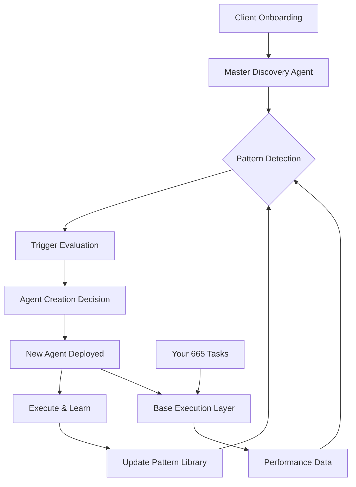

# Agent Intelligence Layer Blueprint
## Self-Evolving Agency System Implementation

---

## System Architecture Overview



---

## Phase 1: Foundation Setup (Week 1)

### 1.1 Create Notion Agent Registry Database

```yaml
notion_database_schema:
  name: "Agent Registry"
  
  properties:
    agent_id:
      type: "unique_id"
      format: "AG-001"
    
    agent_name:
      type: "title"
      example: "ServiceTitan_Connector_Agent"
    
    created_date:
      type: "date"
      auto: "creation_date"
    
    created_by:
      type: "select"
      options: ["Human", "Master_Discovery", "Auto-Triggered", "Child_Agent"]
    
    trigger_condition:
      type: "text"
      example: "New platform discovered: ServiceTitan"
    
    purpose:
      type: "text"
      example: "Extract and standardize ServiceTitan data"
    
    status:
      type: "select"
      options: ["Active", "Testing", "Deprecated", "Failed"]
    
    times_used:
      type: "number"
      auto_increment: true
    
    value_generated:
      type: "currency"
      calculation: "sum_of_impacts"
    
    reusable:
      type: "checkbox"
      default: true
    
    parent_agent:
      type: "relation"
      links_to: "Agent Registry"
    
    child_agents:
      type: "relation"
      links_to: "Agent Registry"
    
    client_specific:
      type: "multi_select"
      options: ["Fastline", "All Clients", "Industry-Specific"]
    
    code_location:
      type: "url"
      example: "/agents/auto_generated/AG-001.js"
    
    pattern_learned:
      type: "text"
      example: "PDF auction results need specialized parsing"
    
    success_metrics:
      type: "text"
      example: "Reduced parsing time from 2 hours to 5 minutes"
```

### 1.2 Create Pattern Library in Notion

```yaml
pattern_database_schema:
  name: "Pattern Library"
  
  properties:
    pattern_id:
      type: "unique_id"
      format: "PAT-001"
    
    pattern_type:
      type: "select"
      options: 
        - "Data Issue"
        - "Process Bottleneck"
        - "Integration Gap"
        - "Performance Problem"
        - "Scaling Opportunity"
    
    discovery_source:
      type: "select"
      options:
        - "Julius AI Analysis"
        - "Parsio Failure"
        - "Manual Process Observed"
        - "Make.com Error"
        - "Client Complaint"
        - "Performance Metric"
    
    trigger_threshold:
      type: "formula"
      example: "occurrence > 3 OR impact > $500 OR time_waste > 2hrs"
    
    solution_template:
      type: "text"
      example: "Create parser agent with Parsio template"
    
    times_encountered:
      type: "number"
      auto_increment: true
    
    agent_created:
      type: "relation"
      links_to: "Agent Registry"
    
    industry_specific:
      type: "select"
      options: ["Universal", "Auction", "Local Service", "SaaS", "E-commerce"]
```

### 1.3 Master Discovery Agent Implementation

```python
# master_discovery_agent.py
# Deploy via Make.com custom code module

import json
from datetime import datetime
import requests

class MasterDiscoveryAgent:
    """
    The prime agent that discovers patterns and spawns children
    """
    
    def __init__(self, client_name):
        self.client = client_name
        self.discoveries = []
        self.patterns_found = []
        self.agents_to_create = []
        
        # Your tool endpoints
        self.tools = {
            'notion': 'YOUR_NOTION_API',
            'julius': 'YOUR_JULIUS_ENDPOINT',
            'parsio': 'YOUR_PARSIO_API',
            'make': 'YOUR_MAKE_WEBHOOK'
        }
        
        # Creation thresholds
        self.thresholds = {
            'time_saved_monthly': 2,  # hours
            'value_impact': 500,      # dollars
            'occurrence_frequency': 3, # times per month
            'error_rate': 0.1,        # 10% failure rate
            'manual_time': 30          # minutes per occurrence
        }
    
    def run_discovery(self):
        """
        Main discovery sequence
        """
        print(f"🔍 Starting discovery for {self.client}")
        
        # Step 1: Audit existing setup
        self.audit_current_state()
        
        # Step 2: Analyze patterns
        self.detect_patterns()
        
        # Step 3: Evaluate for agent creation
        self.evaluate_agent_needs()
        
        # Step 4: Create new agents
        self.spawn_agents()
        
        # Step 5: Update pattern library
        self.update_patterns()
        
        return {
            'discoveries': self.discoveries,
            'patterns': self.patterns_found,
            'agents_created': self.agents_to_create
        }
    
    def audit_current_state(self):
        """
        Discover what exists and what's missing
        """
        
        # Check data sources
        data_audit = {
            'platforms_found': [],
            'data_formats': [],
            'manual_processes': [],
            'integration_gaps': [],
            'performance_issues': []
        }
        
        # Example discovery checks
        checks = [
            self.check_tracking_setup(),
            self.check_data_quality(),
            self.check_automation_gaps(),
            self.check_performance_metrics(),
            self.check_tool_usage()
        ]
        
        for check in checks:
            if check['issues_found']:
                self.discoveries.append(check)
    
    def check_tracking_setup(self):
        """
        Discover tracking issues that need agents
        """
        issues = []
        
        # Check for common tracking problems
        tracking_checks = {
            'no_gtm': 'Google Tag Manager not found',
            'no_conversion_tracking': 'Conversions not tracked',
            'broken_attribution': 'Attribution model broken',
            'missing_utm': 'UTM parameters missing',
            'phone_tracking': 'Phone calls not tracked'
        }
        
        for key, issue in tracking_checks.items():
            # Your detection logic here
            if self.detect_issue(key):
                issues.append({
                    'type': 'tracking',
                    'issue': issue,
                    'impact': 'high',
                    'suggested_agent': f'{key}_fixer_agent'
                })
        
        return {
            'category': 'tracking',
            'issues_found': issues
        }
    
    def detect_patterns(self):
        """
        Identify patterns that warrant agent creation
        """
        
        pattern_rules = [
            {
                'name': 'Repeated Manual Task',
                'condition': lambda x: x['manual_time'] > 30 and x['frequency'] > 5,
                'agent_type': 'Automation_Agent'
            },
            {
                'name': 'Data Format Chaos',
                'condition': lambda x: x['format_variations'] > 3,
                'agent_type': 'Standardization_Agent'
            },
            {
                'name': 'Performance Gap',
                'condition': lambda x: x['metric_gap'] > 20,  # 20% below target
                'agent_type': 'Optimization_Agent'
            },
            {
                'name': 'Missing Integration',
                'condition': lambda x: x['platforms_disconnected'] > 0,
                'agent_type': 'Integration_Agent'
            },
            {
                'name': 'Quality Issues',
                'condition': lambda x: x['error_rate'] > 0.1,
                'agent_type': 'Quality_Control_Agent'
            }
        ]
        
        for discovery in self.discoveries:
            for rule in pattern_rules:
                if rule['condition'](discovery):
                    self.patterns_found.append({
                        'pattern': rule['name'],
                        'agent_needed': rule['agent_type'],
                        'context': discovery
                    })
    
    def evaluate_agent_needs(self):
        """
        Decide which agents to actually create
        """
        
        for pattern in self.patterns_found:
            score = self.calculate_agent_value(pattern)
            
            if score > 100:  # Value score threshold
                self.agents_to_create.append({
                    'agent_type': pattern['agent_needed'],
                    'priority': self.get_priority(score),
                    'pattern': pattern,
                    'estimated_value': score
                })
    
    def calculate_agent_value(self, pattern):
        """
        Score the value of creating this agent
        """
        score = 0
        
        # Time savings value
        if 'manual_time' in pattern['context']:
            monthly_hours = pattern['context']['manual_time'] * pattern['context']['frequency'] / 60
            score += monthly_hours * 50  # $50/hour value
        
        # Error reduction value
        if 'error_rate' in pattern['context']:
            score += pattern['context']['error_rate'] * 1000  # $1000 per 10% error rate
        
        # Performance improvement value
        if 'metric_gap' in pattern['context']:
            score += pattern['context']['metric_gap'] * 50  # $50 per percentage point
        
        return score
    
    def spawn_agents(self):
        """
        Actually create the new agents
        """
        
        for agent_spec in self.agents_to_create:
            # Generate agent code
            agent_code = self.generate_agent_code(agent_spec)
            
            # Save to system
            agent_id = self.save_agent(agent_code, agent_spec)
            
            # Register in Notion
            self.register_agent(agent_id, agent_spec)
            
            # Deploy via Make.com
            self.deploy_agent(agent_id, agent_code)
            
            print(f"✅ Created: {agent_spec['agent_type']} (ID: {agent_id})")
    
    def generate_agent_code(self, spec):
        """
        Generate the actual agent code
        """
        template = f'''
class {spec['agent_type']}:
    """
    Auto-generated agent
    Created: {datetime.now()}
    Pattern: {spec['pattern']['pattern']}
    """
    
    def __init__(self):
        self.name = "{spec['agent_type']}"
        self.trigger = "{spec['pattern']['pattern']}"
        self.priority = "{spec['priority']}"
        
    def execute(self, context):
        # Auto-generated execution logic
        result = self.{self.get_method_name(spec['agent_type'])}(context)
        return result
    
    def {self.get_method_name(spec['agent_type'])}(self, context):
        # Specific logic for this agent type
        pass
'''
        return template
    
    def get_method_name(self, agent_type):
        """Convert agent type to method name"""
        return agent_type.lower().replace('_agent', '').replace('_', '_')
```

---

## Phase 2: Trigger System Implementation (Week 1-2)

### 2.1 Make.com Trigger Scenarios

```javascript
// Scenario: Pattern Detection Trigger
// Runs every hour or on-demand

{
  "scenario_name": "Agent Creation Trigger System",
  "trigger": {
    "type": "webhook|schedule",
    "frequency": "hourly"
  },
  "modules": [
    {
      "name": "Check Notion Discoveries",
      "action": "search_records",
      "params": {
        "database": "Discovery Log",
        "filter": {
          "property": "agent_needed",
          "equals": true
        }
      }
    },
    {
      "name": "Analyze with Julius AI",
      "action": "http_request",
      "params": {
        "url": "julius_ai_endpoint",
        "method": "POST",
        "body": {
          "discoveries": "{{discoveries}}",
          "pattern_library": "{{patterns}}",
          "request": "identify_agent_opportunities"
        }
      }
    },
    {
      "name": "Evaluate Triggers",
      "action": "custom_code",
      "code": `
        const triggers = {
          'MISSING_DATA': {
            condition: (d) => d.null_rate > 0.3,
            agent: 'Data_Recovery_Agent'
          },
          'FORMAT_CHAOS': {
            condition: (d) => d.format_count > 3,
            agent: 'Standardization_Agent'
          },
          'MANUAL_PROCESS': {
            condition: (d) => d.manual_hours > 2,
            agent: 'Automation_Agent'
          },
          'BROKEN_TRACKING': {
            condition: (d) => d.conversion_match === false,
            agent: 'Tracking_Repair_Agent'
          }
        };
        
        let agents_needed = [];
        
        for (let trigger in triggers) {
          if (triggers[trigger].condition(data)) {
            agents_needed.push({
              type: triggers[trigger].agent,
              trigger: trigger,
              priority: calculatePriority(data)
            });
          }
        }
        
        return agents_needed;
      `
    },
    {
      "name": "Create Agents",
      "action": "iterator",
      "foreach": "{{agents_needed}}",
      "do": {
        "action": "http_request",
        "params": {
          "url": "{{your_api}}/create_agent",
          "method": "POST",
          "body": {
            "agent_spec": "{{item}}"
          }
        }
      }
    },
    {
      "name": "Update Notion Registry",
      "action": "create_record",
      "params": {
        "database": "Agent Registry",
        "properties": {
          "name": "{{agent.name}}",
          "created_by": "Auto-Trigger",
          "trigger": "{{agent.trigger}}",
          "status": "Active"
        }
      }
    }
  ]
}
```

### 2.2 Trigger Configuration Database

```yaml
# Store in Notion as "Trigger Configuration"

trigger_definitions:
  data_triggers:
    missing_field:
      condition: "null_rate > 30%"
      threshold: 0.3
      agent_template: "Data_Recovery_Agent"
      priority: "HIGH"
      
    format_inconsistency:
      condition: "unique_formats > 3"
      threshold: 3
      agent_template: "Format_Standardization_Agent"
      priority: "MEDIUM"
      
    parsing_failure:
      condition: "parsio_error_rate > 10%"
      threshold: 0.1
      agent_template: "Custom_Parser_Agent"
      priority: "HIGH"
  
  performance_triggers:
    kpi_gap:
      condition: "actual < target * 0.8"
      threshold: 20  # percent below target
      agent_template: "KPI_Optimization_Agent"
      priority: "CRITICAL"
      
    cost_overrun:
      condition: "spend > budget * 1.2"
      threshold: 20  # percent over budget
      agent_template: "Cost_Optimization_Agent"
      priority: "HIGH"
  
  process_triggers:
    manual_bottleneck:
      condition: "manual_time > 120 minutes"
      threshold: 120
      agent_template: "Process_Automation_Agent"
      priority: "MEDIUM"
      
    repetitive_task:
      condition: "monthly_frequency > 10"
      threshold: 10
      agent_template: "Task_Automation_Agent"
      priority: "MEDIUM"
  
  integration_triggers:
    platform_discovered:
      condition: "new_platform_found"
      threshold: 1
      agent_template: "Platform_Connector_Agent"
      priority: "MEDIUM"
      
    sync_failure:
      condition: "sync_error_count > 3"
      threshold: 3
      agent_template: "Sync_Repair_Agent"
      priority: "HIGH"
```

---

## Phase 3: Agent Templates Library (Week 2)

### 3.1 Base Agent Templates

```python
# base_agent_template.py
# This is the parent class all auto-generated agents inherit from

class BaseAutoAgent:
    """
    Foundation for all auto-generated agents
    """
    
    def __init__(self, config):
        self.id = self.generate_id()
        self.name = config['name']
        self.trigger = config['trigger']
        self.created_date = datetime.now()
        self.created_by = config['created_by']
        self.status = 'testing'
        self.executions = 0
        self.value_generated = 0
        
        # Tool connections
        self.tools = {
            'notion': NotionClient(config['notion_key']),
            'make': MakeClient(config['make_key']),
            'julius': JuliusClient(config['julius_key']),
            'parsio': ParsioClient(config['parsio_key'])
        }
    
    def execute(self, context):
        """
        Main execution method - must be implemented by child
        """
        try:
            # Pre-execution
            self.log_start(context)
            
            # Execute specific logic
            result = self.run_logic(context)
            
            # Post-execution
            self.log_result(result)
            self.update_metrics(result)
            self.check_for_child_agents(result)
            
            return result
            
        except Exception as e:
            self.handle_error(e)
            
    def run_logic(self, context):
        """
        Override this in child agents
        """
        raise NotImplementedError
        
    def check_for_child_agents(self, result):
        """
        Detect if this agent should spawn children
        """
        patterns = self.analyze_for_patterns(result)
        
        for pattern in patterns:
            if self.should_create_child(pattern):
                self.spawn_child_agent(pattern)
    
    def spawn_child_agent(self, pattern):
        """
        Create a new agent based on discovered pattern
        """
        child_config = {
            'name': f"{self.name}_Child_{pattern['type']}",
            'trigger': pattern['trigger'],
            'created_by': self.id,
            'parent': self.id,
            'purpose': pattern['solution']
        }
        
        # Generate and deploy child
        child = AgentFactory.create(child_config)
        child.deploy()
        
        # Register relationship
        self.register_child(child.id)
```

### 3.2 Specialized Agent Templates

```python
# specialized_templates.py

class DataRecoveryAgent(BaseAutoAgent):
    """
    Auto-created when missing data detected
    """
    
    def run_logic(self, context):
        missing_field = context['missing_field']
        
        # Try multiple recovery strategies
        strategies = [
            self.check_alternate_source,
            self.derive_from_related_data,
            self.use_industry_average,
            self.request_from_client
        ]
        
        for strategy in strategies:
            result = strategy(missing_field)
            if result['success']:
                return result
                
        return {'success': False, 'tried': len(strategies)}

class AutomationAgent(BaseAutoAgent):
    """
    Auto-created when manual process detected
    """
    
    def run_logic(self, context):
        process = context['manual_process']
        
        # Build automation
        steps = [
            self.analyze_process_steps(process),
            self.identify_tools_needed(),
            self.create_make_scenario(),
            self.test_automation(),
            self.deploy_automation()
        ]
        
        automation = {}
        for step in steps:
            result = step(automation)
            automation.update(result)
            
        return automation

class IntegrationAgent(BaseAutoAgent):
    """
    Auto-created when new platform discovered
    """
    
    def run_logic(self, context):
        platform = context['platform']
        
        # Build integration
        integration_steps = {
            'research': self.research_platform_api(platform),
            'auth': self.setup_authentication(),
            'parsio': self.create_parsio_template(),
            'make': self.build_make_scenario(),
            'test': self.test_data_flow(),
            'deploy': self.activate_integration()
        }
        
        results = {}
        for step_name, step_func in integration_steps.items():
            results[step_name] = step_func()
            
        return results

class OptimizationAgent(BaseAutoAgent):
    """
    Auto-created when performance gap detected
    """
    
    def run_logic(self, context):
        metric = context['underperforming_metric']
        gap = context['gap_size']
        
        # Optimization sequence
        optimization = {
            'baseline': self.establish_baseline(metric),
            'analysis': self.root_cause_analysis(metric),
            'hypothesis': self.generate_hypotheses(),
            'tests': self.design_tests(),
            'results': self.run_tests(),
            'implementation': self.implement_winner()
        }
        
        return optimization
```

---

## Phase 4: Learning & Pattern System (Week 3)

### 4.1 Pattern Learning Database

```yaml
# Notion Database: "Pattern Learning"

schema:
  pattern_id:
    type: "unique_id"
    
  pattern_signature:
    type: "formula"
    example: "platform:servicetitan + data:scheduling + format:json"
    
  first_seen:
    type: "date"
    
  times_seen:
    type: "number"
    
  clients_affected:
    type: "multi_select"
    
  solution_applied:
    type: "relation"
    links_to: "Agent Registry"
    
  success_rate:
    type: "percentage"
    
  time_to_solve:
    type: "duration"
    
  reusable_template:
    type: "checkbox"
    
  template_code:
    type: "code"
    
  industry_specific:
    type: "select"
    
  notes:
    type: "text"
```

### 4.2 Learning System Implementation

```python
# learning_system.py

class AgentLearningSystem:
    """
    Tracks patterns and improves over time
    """
    
    def __init__(self):
        self.pattern_memory = {}
        self.solution_library = {}
        self.performance_history = {}
        
    def learn_from_execution(self, agent_id, execution_result):
        """
        Extract learnings from each agent execution
        """
        
        # Record what happened
        pattern = self.extract_pattern(execution_result)
        
        # Check if we've seen this before
        if pattern in self.pattern_memory:
            self.pattern_memory[pattern]['count'] += 1
            self.pattern_memory[pattern]['outcomes'].append(execution_result)
        else:
            self.pattern_memory[pattern] = {
                'first_seen': datetime.now(),
                'count': 1,
                'outcomes': [execution_result]
            }
        
        # Update solution library if successful
        if execution_result['success']:
            self.update_solution_library(pattern, execution_result['solution'])
            
        # Check if pattern is common enough to templateize
        if self.pattern_memory[pattern]['count'] > 5:
            self.create_template(pattern)
    
    def suggest_agent_for_pattern(self, new_pattern):
        """
        Use past learning to suggest solutions
        """
        
        # Find similar patterns
        similar = self.find_similar_patterns(new_pattern)
        
        if similar:
            # Use the most successful solution
            best_solution = max(similar, key=lambda x: x['success_rate'])
            return {
                'suggested_agent': best_solution['agent_type'],
                'confidence': best_solution['success_rate'],
                'based_on': best_solution['pattern_id']
            }
        else:
            # New pattern - create experimental agent
            return {
                'suggested_agent': 'Experimental_Agent',
                'confidence': 0,
                'based_on': None
            }
    
    def create_template(self, pattern):
        """
        Convert successful pattern into reusable template
        """
        
        # Analyze all outcomes for this pattern
        outcomes = self.pattern_memory[pattern]['outcomes']
        successful = [o for o in outcomes if o['success']]
        
        if len(successful) / len(outcomes) > 0.8:  # 80% success rate
            template = {
                'pattern': pattern,
                'solution_steps': self.extract_common_steps(successful),
                'average_time': self.calculate_avg_time(successful),
                'success_rate': len(successful) / len(outcomes),
                'template_code': self.generate_template_code(successful)
            }
            
            # Save to solution library
            self.solution_library[pattern] = template
            
            # Create reusable agent
            self.create_reusable_agent(template)
```

---

## Phase 5: Deployment Infrastructure (Week 3-4)

### 5.1 Agent Deployment System

```javascript
// Make.com Scenario: Agent Deployment Pipeline

{
  "name": "Agent Deployment Pipeline",
  "modules": [
    {
      "name": "Receive Agent Specification",
      "type": "webhook",
      "output": "agent_spec"
    },
    {
      "name": "Generate Agent Code",
      "type": "http",
      "url": "{{your_api}}/generate_agent",
      "method": "POST",
      "body": {
        "spec": "{{agent_spec}}",
        "template": "{{agent_spec.template}}",
        "parent": "{{agent_spec.parent_id}}"
      },
      "output": "agent_code"
    },
    {
      "name": "Validate Agent",
      "type": "custom_code",
      "code": `
        // Test agent logic
        const testCases = [
          {input: mockData1, expected: result1},
          {input: mockData2, expected: result2}
        ];
        
        let valid = true;
        for (let test of testCases) {
          const result = runAgent(agent_code, test.input);
          if (!validateResult(result, test.expected)) {
            valid = false;
            break;
          }
        }
        
        return {valid: valid, test_results: testResults};
      `
    },
    {
      "name": "Deploy Agent",
      "type": "router",
      "routes": [
        {
          "condition": "{{valid}} == true",
          "modules": [
            {
              "name": "Save to Repository",
              "type": "http",
              "url": "{{github_api}}/create_file",
              "body": {
                "path": "/agents/auto/{{agent_id}}.js",
                "content": "{{agent_code}}"
              }
            },
            {
              "name": "Register in Notion",
              "type": "notion",
              "action": "create_page",
              "database": "Agent Registry",
              "properties": {
                "name": "{{agent_spec.name}}",
                "status": "Active",
                "code_location": "{{github_url}}"
              }
            },
            {
              "name": "Activate in Make.com",
              "type": "http",
              "url": "{{make_api}}/scenarios",
              "method": "POST",
              "body": {
                "name": "{{agent_spec.name}}_Executor",
                "blueprint": "{{generated_blueprint}}"
              }
            }
          ]
        },
        {
          "condition": "{{valid}} == false",
          "modules": [
            {
              "name": "Log Failure",
              "type": "notion",
              "action": "create_page",
              "database": "Failed Agents",
              "properties": {
                "reason": "{{test_results}}",
                "spec": "{{agent_spec}}"
              }
            }
          ]
        }
      ]
    }
  ]
}
```

### 5.2 Agent Monitoring Dashboard

```yaml
# Notion Dashboard Views

views:
  agent_performance:
    type: "gallery"
    cards_show:
      - agent_name
      - status
      - executions_today
      - success_rate
      - value_generated
    filter: "status = Active"
    sort: "value_generated DESC"
  
  pattern_discoveries:
    type: "table"
    columns:
      - pattern_type
      - times_encountered
      - agent_created
      - success_rate
    filter: "times_encountered > 3"
    
  agent_genealogy:
    type: "board"
    group_by: "parent_agent"
    cards_show:
      - agent_name
      - created_date
      - trigger_condition
      
  roi_tracking:
    type: "calendar"
    date_property: "created_date"
    cards_show:
      - agent_name
      - value_generated
      - time_saved
```

---

## Phase 6: Implementation Roadmap

### Week 1: Foundation
```markdown
Day 1-2: Setup
☐ Create Notion databases (Agent Registry, Pattern Library)
☐ Deploy Master Discovery Agent
☐ Configure trigger thresholds

Day 3-4: First Run
☐ Run Master Discovery on one client
☐ Let it create 3-5 child agents
☐ Monitor and debug

Day 5-7: Refinement
☐ Adjust trigger thresholds based on results
☐ Fix any deployment issues
☐ Document first patterns
```

### Week 2: Expansion
```markdown
Day 8-10: Scale Testing
☐ Run on 3 more clients
☐ Observe pattern similarities
☐ Build first reusable templates

Day 11-14: Optimization
☐ Refine agent generation code
☐ Improve pattern matching
☐ Create performance monitoring
```

### Week 3: Learning System
```markdown
Day 15-17: Pattern Library
☐ Analyze all patterns found
☐ Create solution templates
☐ Build reusability system

Day 18-21: Automation
☐ Fully automate agent deployment
☐ Set up monitoring dashboards
☐ Create alert system
```

### Week 4: Full Deployment
```markdown
Day 22-24: Production Ready
☐ Deploy across all clients
☐ Monitor system performance
☐ Document learnings

Day 25-28: Optimization
☐ Refine based on results
☐ Create agent management UI
☐ Plan next evolution
```

---

## Success Metrics

### System Health Metrics
```yaml
metrics:
  agent_creation:
    target: "10-15 agents/week"
    current: "tracking"
    
  pattern_discovery:
    target: "20+ patterns/week"
    current: "tracking"
    
  automation_rate:
    target: "80% problems auto-solved"
    current: "tracking"
    
  false_positive_rate:
    target: "<10%"
    current: "tracking"
    
  reusability_rate:
    target: ">60% agents reusable"
    current: "tracking"
```

### Value Metrics
```yaml
value_tracking:
  time_saved:
    target: "100 hours/month"
    calculation: "sum(agent.time_saved)"
    
  cost_savings:
    target: "$5,000/month"
    calculation: "time_saved * $50"
    
  problems_solved:
    target: "50/month"
    calculation: "count(agent.executions)"
    
  client_impact:
    target: "All clients improved"
    calculation: "unique(agent.client)"
```

---

## Emergency Procedures

### If Agents Create Too Many Children
```python
class AgentLimiter:
    MAX_CHILDREN = 10
    MAX_GENERATION = 3
    
    def can_create_child(self, parent_agent):
        if parent_agent.children_count >= self.MAX_CHILDREN:
            return False
        if parent_agent.generation >= self.MAX_GENERATION:
            return False
        return True
```

### If Agent Fails Repeatedly
```python
class AgentHealthMonitor:
    def check_agent_health(self, agent_id):
        agent = self.get_agent(agent_id)
        
        if agent.failure_rate > 0.5:  # 50% failure
            self.quarantine_agent(agent_id)
            self.notify_human(f"Agent {agent_id} quarantined")
            self.create_diagnostic_agent(agent_id)
```

---

## Next Evolution Ideas

### Future Capabilities
1. **Cross-Client Learning**: Agents share learnings across all clients
2. **Predictive Creation**: Create agents before problems occur
3. **Self-Healing**: Agents fix themselves when broken
4. **Agent Marketplace**: Share agents with other agencies
5. **AI-Powered Evolution**: Agents improve their own code

---

## Conclusion

This Intelligence Layer transforms your agency from:
- **Reactive** → **Proactive**
- **Manual** → **Autonomous**
- **Static** → **Evolving**
- **Linear** → **Exponential**

Your 665 tasks become the **foundation**, but the system builds its own **skyscraper** on top, creating new capabilities as it discovers new challenges.

**This is true AI-powered operations.**