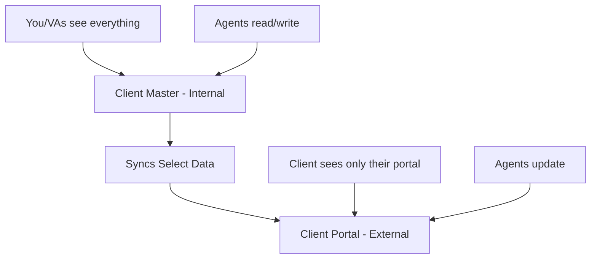

# Client Portal vs Client Master Structure
## Why You Need Both (And How They Connect)

---

## The Critical Distinction

### 🔐 Client Master Database (INTERNAL ONLY)
**Who sees this**: You, your VAs, your agents
**What's in it**: EVERYTHING - including sensitive intel
**Purpose**: Your complete operational brain

### 🌐 Client Portal (CLIENT-FACING)
**Who sees this**: The client (and you)
**What's in it**: Only what clients should see
**Purpose**: Impressive client experience

---

## Why They MUST Be Separate

### Client Master Contains Sensitive Info:
```yaml
Things clients should NEVER see:
- Health Score: 4 (uh oh)
- Next Action: "Save this account"
- Intelligence Gathered: "Owner is difficult"
- Churn Risk: High
- Competitors Doing Better: Yes
- Profit Margin: 70%
- Internal Notes: "Scope creep risk"
- Other Clients: Full list
- Pattern Library: What we learned from their mistakes
```

### Client Portal Shows Only:
```yaml
Things clients LOVE to see:
- Their KPI Dashboard
- Campaign Performance
- Completed Tasks
- Upcoming Work
- Reports & Deliverables
- Meeting Notes
- Team Contacts
- Success Metrics
- Resources & Training
```

---

## The Proper Architecture



---

## How to Structure Client Portals

### Option 1: Separate Notion Workspace (Most Secure)
```yaml
Structure:
Main Workspace (Yours):
  - Client Master (all clients)
  - All operational databases
  
Client Workspace (Per Client):
  - Their portal only
  - Shared with client
  - Limited data synced

Pros:
  - Complete separation
  - No accidental exposure
  - Client can't see other areas

Cons:
  - Multiple workspaces to manage
  - Notion pricing per workspace
```

### Option 2: Same Workspace, Different Permissions (Easier)
```yaml
Structure:
Your Workspace:
  ├── Internal (Private)
  │   ├── Client Master
  │   ├── Discovery Notes
  │   └── Agent Logs
  └── Client Portals (Shared)
      ├── Client A Portal
      ├── Client B Portal
      └── Client C Portal

Pros:
  - Single workspace
  - Easier management
  - One Notion subscription

Cons:
  - Must be careful with permissions
  - Risk of accidental sharing
```

### Option 3: Different Platform for Portals (Recommended)
```yaml
Internal Operations: Notion
  - Client Master
  - All internal databases
  
Client Portals: Simple Platform
  - Portal.io
  - Clientary
  - Custom subdomain site
  - Even shared Google Drive folder

Pros:
  - Complete separation
  - No permission risks
  - Professional appearance
  - Custom domain (portal.youragency.com)

Cons:
  - Another tool to manage
  - Additional cost ($50-100/month)
```

---

## What Each Contains

### Client Master Database (Internal)
```yaml
Everything about the client:
- Basic Information
  - Company details
  - All contacts
  - Revenue/employees
  
- Intelligence
  - Pain points
  - Competitors
  - Weaknesses
  - Opportunities
  
- Sales Process
  - Discovery notes
  - Proposal versions
  - Negotiation history
  - Objections faced
  
- Operations
  - Health score
  - Profit margin
  - Team notes
  - Risk factors
  
- Performance
  - All metrics
  - Agent executions
  - Pattern matches
  - Predictions
```

### Client Portal (Client-Facing)
```yaml
Only positive, useful information:
- Dashboard
  - KPIs (the good ones)
  - Progress bars
  - Win celebrations
  
- Work Management
  - Completed tasks ✓
  - Upcoming work
  - Timeline
  
- Resources
  - Reports
  - Deliverables
  - Training docs
  - Best practices
  
- Communication
  - Meeting notes
  - Announcements
  - Support requests
```

---

## The Data Sync Strategy

### Automated Sync (Make.com):
```javascript
// Every day at 6 AM
1. Pull from Client Master (Internal)
2. Filter to positive/relevant data only
3. Update Client Portal with:
   - Performance metrics (good ones)
   - Completed tasks
   - Upcoming work
   - New reports
4. Never sync:
   - Health scores
   - Internal notes
   - Profit margins
   - Other client data
```

### Manual Updates:
```yaml
VA Process:
1. Complete task in Client Master
2. If client-appropriate:
   - Add to Client Portal
3. If sensitive:
   - Keep internal only
```

---

## Setting Up Both Properly

### Step 1: Client Master (Internal)
```yaml
Location: Your main Notion workspace
Access: You + VAs + Agents (API)
Contains: Everything
Views: All operational views
```

### Step 2: Client Portal Template
```yaml
Create template portal with:
Page Structure:
  📊 Dashboard
  ├── This Month's Wins
  ├── KPI Tracking
  └── Quick Stats
  
  📋 Work Management
  ├── Completed This Week
  ├── In Progress
  └── Upcoming
  
  📈 Reports
  ├── Weekly Reports
  ├── Monthly Analysis
  └── Campaign Results
  
  🎯 Resources
  ├── Brand Assets
  ├── Best Practices
  └── Training Videos
  
  💬 Communication
  ├── Meeting Notes
  ├── Announcements
  └── Contact Team
```

### Step 3: Portal Creation Process
```yaml
When client signs:
1. Notion_Portal_Builder_Agent creates portal
2. Uses template structure
3. Sets permissions (client = viewer/commenter)
4. Shares access link
5. Updates Client Master with portal URL
```

---

## Example Scenarios

### Scenario 1: Bad Month Performance
```yaml
In Client Master:
- Health Score: 3
- Note: "CTR dropped 40%, investigating"
- Risk: "Client might churn"

In Client Portal:
- "Optimizing campaigns for better performance"
- "New strategy launching next week"
- Focus on what we're doing to fix
```

### Scenario 2: Competitor Intelligence
```yaml
In Client Master:
- "Competitor X spending $50K/month on ads"
- "They're vulnerable on mobile experience"
- "We can beat them with local SEO"

In Client Portal:
- "Competitive advantage opportunities identified"
- "New local strategy launching"
- No mention of specific competitor intel
```

### Scenario 3: Scope Creep
```yaml
In Client Master:
- "Client asking for free extras again"
- "Need to enforce contract"
- "Profit margin dropping"

In Client Portal:
- "Additional services available"
- "See our enhancement packages"
- Professional boundary setting
```

---

## The Psychology

### Client Master Mindset:
"This is our war room - complete transparency internally"

### Client Portal Mindset:
"This is their showroom - celebrate wins, show progress"

### Never Mix Them:
- War room discussions stay internal
- Showroom displays only the best
- Client feels supported, not analyzed

---

## Quick Decision Framework

### Use Client Master for:
- All internal operations
- Complete data picture
- Team collaboration
- Agent intelligence
- Pattern detection
- Risk management

### Use Client Portal for:
- Client-facing dashboards
- Celebrating wins
- Showing progress
- Delivering reports
- Building confidence
- Impressive experience

---

## Recommended Setup

### For You:
1. **Client Master** in your Notion (complete control)
2. **Client Portals** as separate pages with restricted permissions
3. **Never give clients access** to your main workspace
4. **Sync selected data** via Make.com automation

### The Rule:
**Client Master = Everything**
**Client Portal = Everything that makes them happy**

This separation is critical for professional operations!