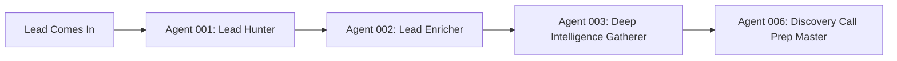
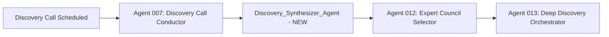
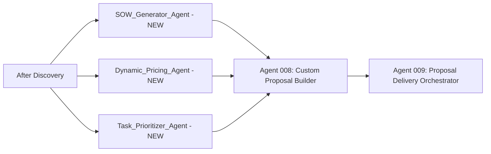
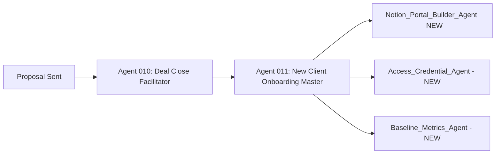

# Complete Agent Flow Sequence
## The ACTUAL Order & Output Depth

---

## The Real Flow (More Agents Than We Tested)

### Pre-Discovery Phase


### Discovery Phase


### Proposal Phase


### Close & Onboard Phase


---

## CORRECT FULL SEQUENCE

### Phase 1: Lead Generation (Agents 001-006)
**Before we even get to discovery:**

1. **Agent 001: Lead Hunter** finds the lead
2. **Agent 002: Lead Enricher** adds data (revenue, employees, tech stack)
3. **Agent 003: Deep Intelligence Gatherer** researches everything
4. **Agent 004: Outreach Message Crafter** creates personalized outreach
5. **Agent 005: Outreach Campaign Executor** sends and follows up
6. **Agent 006: Discovery Call Prep Master** prepares for call

**By the time we get to discovery, we already know a lot!**

### Phase 2: Discovery & Analysis (007 + NEW agents)
**This is what we tested, but fuller:**

7. **Agent 007: Discovery Call Conductor** runs the actual call
8. **Discovery_Synthesizer_Agent** analyzes everything (NEW)
9. **Agent 012: Expert Council Selector** picks which experts to channel
10. **Agent 013: Deep Discovery Orchestrator** does even deeper analysis

### Phase 3: Proposal Creation (Multiple agents working together)
**More complex than our test:**

11. **SOW_Generator_Agent** creates the SOW (NEW)
12. **Dynamic_Pricing_Agent** creates pricing options (NEW)
13. **Task_Prioritizer_Agent** plans the work sequence (NEW)
14. **Agent 014: 665-Task Mapper** maps to your specific tasks
15. **Agent 008: Custom Proposal Builder** combines everything into proposal

### Phase 4: Delivery & Close
16. **Agent 009: Proposal Delivery Orchestrator** sends and tracks
17. **Agent 010: Deal Close Facilitator** handles objections
18. **Agent 011: New Client Onboarding Master** starts onboarding

### Phase 5: Portal & Setup
19. **Notion_Portal_Builder_Agent** creates client portal (NEW)
20. **Access_Credential_Agent** gathers all access (NEW)
21. **Baseline_Metrics_Agent** establishes baselines (NEW)

---

## About Output Depth - YES, More Detail!

### What We Showed in Test (Condensed)
- Discovery Synthesis: 1-2 pages
- SOW: 1 page
- Pricing: Basic options

### What Agents ACTUALLY Produce

#### Discovery_Synthesizer_Agent FULL Output:
```markdown
1. Executive Summary (1 page)
   - Three critical insights
   - Primary opportunity
   - Recommended focus

2. Detailed Analysis (5-7 pages)
   - Business Model Deconstruction
   - Competitive Landscape Map
   - Customer Journey Analysis
   - Financial Impact Modeling
   - Technology Stack Audit
   - Market Position Assessment

3. Problem/Opportunity Matrix (2 pages)
   - 20-30 specific problems identified
   - Ranked by impact vs effort
   - Dollar value assigned to each
   - Quick wins highlighted

4. Strategic Recommendations (3 pages)
   - Immediate actions (Week 1)
   - Foundation building (Month 1)
   - Growth initiatives (Quarter 1)
   - Transformation roadmap (Year 1)

5. Expert Council Analysis (2 pages)
   - What Munger would say
   - What Drucker would focus on
   - What industry experts recommend

Total: 15-20 page comprehensive analysis
```

#### SOW_Generator_Agent FULL Output:
```markdown
1. Executive Summary
2. Current Situation Analysis
3. Objectives & Success Metrics
4. Scope of Work (detailed)
   - Phase 1: Foundation (Week 1-4)
     * Specific deliverables
     * Success criteria
     * Dependencies
   - Phase 2: Growth (Week 5-12)
     * Specific deliverables
     * Success criteria
     * Dependencies
   - Phase 3: Scale (Ongoing)
     * Specific deliverables
     * Success criteria
     * Dependencies
5. Investment & Payment Terms
6. Timeline & Milestones
7. Roles & Responsibilities
8. Terms & Conditions
9. Guarantee & Risk Mitigation
10. Acceptance Signature Block

Total: 8-12 page complete SOW
```

#### Dynamic_Pricing_Agent FULL Output:
```markdown
1. Pricing Psychology Analysis
   - Customer price sensitivity
   - Competitor pricing audit
   - Value perception mapping

2. Three Package Options (each 2 pages)
   Package 1: Essentials
   - 15-20 specific services listed
   - Deliverables detailed
   - Limitations clearly stated
   
   Package 2: Growth (Target)
   - 25-35 specific services listed
   - Additional value highlighted
   - ROI calculations shown
   
   Package 3: Enterprise
   - 40+ specific services listed
   - Premium features emphasized
   - White-glove elements

3. ROI Modeling
   - Conservative scenario
   - Expected scenario
   - Best-case scenario

4. Payment Options
   - Monthly
   - Quarterly (5% discount)
   - Annual (15% discount)
   - Performance-based alternative

5. Value Stack Visualization
   - Total value: $XX,XXX
   - Your investment: $X,XXX
   - Your savings: $XX,XXX

Total: 10-12 pages with full details
```

---

## The Data Flow Between Agents

```yaml
Lead_Hunter → Lead_Enricher:
  passes: company_name, website, contact_info
  
Lead_Enricher → Intelligence_Gatherer:
  passes: enriched_data, company_size, revenue, tech_stack

Intelligence_Gatherer → Discovery_Prep:
  passes: complete_research, pain_points, opportunities

Discovery_Prep → Discovery_Call:
  passes: call_script, questions, case_studies

Discovery_Call → Discovery_Synthesizer:
  passes: call_notes, problems_identified, goals, budget

Discovery_Synthesizer → Multiple Agents:
  passes_to_SOW: synthesis, recommendations, priority_problems
  passes_to_Pricing: value_identified, ROI_potential, urgency
  passes_to_TaskMap: problems_to_solve, service_needs

All_Proposal_Agents → Proposal_Builder:
  passes: combined_proposal_elements

Proposal_Builder → Delivery:
  passes: complete_proposal_package
```

---

## So for Integrity Greens, the FULL Flow Would Be:

### Already Happened (in theory):
1. **Lead Hunter** found them
2. **Lead Enricher** discovered: $3-4M revenue, 25 employees, family-owned
3. **Intelligence Gatherer** found: dated website, weak social, 12 GMB reviews
4. **Discovery Prep** created: questions about commercial vs residential, seasonality

### Our Test Covered:
5. **Discovery Call** happened (we had notes)
6. **Discovery_Synthesizer** found $166K/month opportunity ✅
7. **Expert Council Selector** would pick: Drucker, Munger, Marcus Sheridan
8. **Deep Discovery** would go even deeper (50+ page report)

### Then (Parallel Processing):
9. **SOW_Generator** creates 8-page SOW ✅
10. **Dynamic_Pricing** creates 10-page pricing ✅  
11. **Task_Prioritizer** maps which of 665 tasks to do
12. **Task Mapper** assigns specific tasks to timeline

### Finally:
13. **Proposal Builder** combines into 30-page masterpiece
14. **Proposal Delivery** sends with video walkthrough
15. **Close Facilitator** handles "it's too expensive" objection
16. **Onboarding Master** kicks off upon signing

---

## The Key Insight

**We tested the CRITICAL PATH** (Discovery → Synthesis → SOW → Pricing)

But the **FULL SYSTEM** has much more:
- More agents involved (20+ in full flow)
- More data passed between them
- More detailed outputs (100+ pages total)
- More intelligence building on intelligence

---

## Should We Add More Detail?

**YES!** For production, each agent should produce:
- **Deeper analysis** (not just highlights)
- **More specific recommendations** (with step-by-step)
- **Better formatting** (professional documents)
- **More data passed forward** (for next agents to use)

The test showed the logic works. 
Production would have 10x more depth!