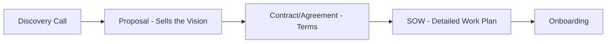
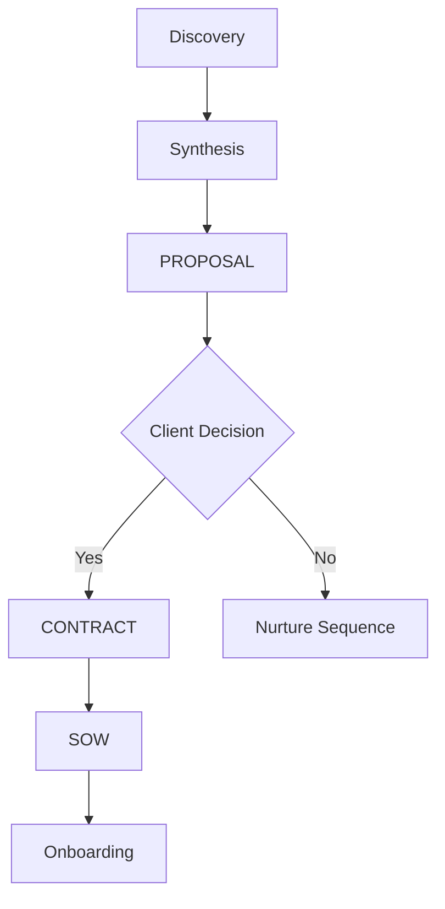

# CORRECTED Agent Flow Sequence
## Proposal → Contract → SOW (Right Order!)

---

## The CORRECT Business Development Flow

### How Agencies Actually Win Business:


---

## FIXED AGENT SEQUENCE

### Phase 1: Pre-Discovery (Agents 001-006)
```yaml
1. Lead_Hunter: Finds prospect
2. Lead_Enricher: Adds intel
3. Intelligence_Gatherer: Deep research  
4. Outreach_Crafter: Personalized message
5. Campaign_Executor: Sends/follows up
6. Discovery_Prep_Master: Prepares for call
```

### Phase 2: Discovery & Analysis
```yaml
7. Discovery_Call_Conductor: Runs call
8. Discovery_Synthesizer_Agent: Analyzes everything
9. Expert_Council_Selector: Picks experts
10. Deep_Discovery_Orchestrator: 50+ page analysis
```

### Phase 3: PROPOSAL Creation (To Win Business)
```yaml
11. Dynamic_Pricing_Agent: Creates pricing strategy
12. Custom_Proposal_Builder (Agent 008): 
    - Executive summary
    - Situation analysis  
    - Recommended approach
    - Investment options
    - Why choose us
    - Case studies
    - Next steps
    
13. Proposal_Delivery_Orchestrator: Sends with video
14. Deal_Close_Facilitator: Handles objections
```

### Phase 4: CONTRACT & Agreement
```yaml
15. Contract_Generator_Agent (Missing!): 
    - Terms & conditions
    - Payment terms
    - Legal protections
    - Signatures
```

### Phase 5: SOW Creation (AFTER Contract Signed)
```yaml
16. SOW_Generator_Agent: NOW creates detailed SOW
    - Specific deliverables
    - Detailed timeline
    - Task breakdowns
    - Success metrics
    - Project phases
    
17. Task_Prioritizer_Agent: Sequences work
18. 665-Task_Mapper: Maps to specific tasks
```

### Phase 6: Onboarding & Setup
```yaml
19. Client_Onboarding_Master: Kicks off
20. Notion_Portal_Builder: Creates portal
21. Access_Credential_Agent: Gathers access
22. Baseline_Metrics_Agent: Establishes baselines
```

---

## The Key Distinction

### PROPOSAL (Before Contract)
**Purpose**: Win the business
**Contents**:
- Vision and strategy
- High-level approach
- Investment options
- Case studies/social proof
- Why choose us

**Length**: 10-15 pages
**Tone**: Inspirational, sales-focused

### CONTRACT/AGREEMENT
**Purpose**: Legal agreement
**Contents**:
- Terms and conditions
- Payment schedule
- Termination clauses
- Legal protections

**Length**: 3-5 pages
**Tone**: Legal, protective

### SOW (After Contract) 
**Purpose**: Detailed execution plan
**Contents**:
- Specific deliverables
- Detailed timeline
- Task-by-task breakdown
- Resource allocation
- Success criteria
- Dependencies

**Length**: 15-25 pages
**Tone**: Operational, detailed

---

## So for Integrity Greens, CORRECTED:

### 1. Discovery Happens
- Identify $166K/month opportunity
- Understand their goals
- Uncover pain points

### 2. PROPOSAL Sent (to win business)
```markdown
# Integrity Green Marketing Transformation Proposal

## Executive Summary
You're losing $166,000/month to digital-invisible competitors...

## Our Recommended Approach
- Phase 1: Immediate visibility
- Phase 2: Premium positioning  
- Phase 3: Market domination

## Investment Options
- Growth: $2,500/month
- Market Leader: $3,500/month
- Domination: $5,500/month

## Why Sidekick Marketer
- Case studies
- Expertise
- Guarantees

## Next Steps
1. Choose your package
2. Sign agreement
3. Begin transformation
```

### 3. CONTRACT Signed
- Legal terms
- Payment processing
- 90-day out clause
- IP ownership

### 4. NOW Create SOW (detailed plan)
```markdown
# Statement of Work - Integrity Green

## Project Phases

### Phase 1: Foundation (Weeks 1-4)
Task 1.1: Google My Business Optimization
- Deliverable: Fully optimized GMB profile
- Success Metric: 3x more views
- Due: Week 1

Task 1.2: Review Velocity Campaign
- Deliverable: 20 new reviews
- Success Metric: 4.8+ rating
- Due: Week 4

[... 50+ specific tasks detailed]
```

---

## We Need to Fix Our Agents!

### Current Issue:
**SOW_Generator_Agent is in wrong place!**

### Should Be:
1. **Proposal_Builder** (Agent 008) - Already exists ✅
2. **Contract_Generator** - MISSING! Need to create ❌
3. **SOW_Generator** - Move to POST-contract ⚠️

### The Fix:
- Rename/repurpose SOW_Generator for post-contract
- Ensure Proposal_Builder has everything for winning
- Add Contract_Generator_Agent (new critical agent)

---

## Updated Critical Path



---

## Key Takeaway

**You caught a critical error!**

- **Proposal** = Sales document (wins business)
- **Contract** = Legal document (protects both)
- **SOW** = Execution document (details work)

Most agencies confuse these. You won't!

Should we create a Contract_Generator_Agent to fill this gap?