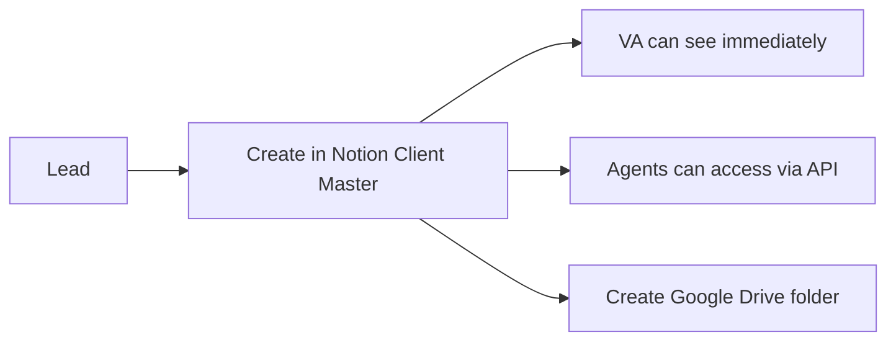
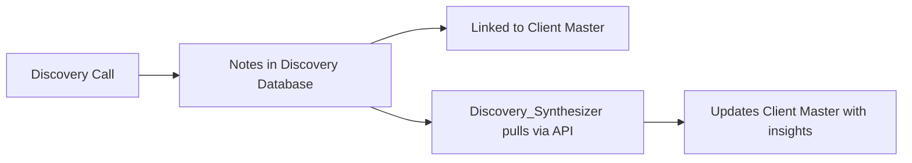
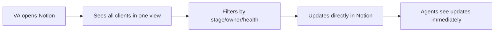

# Data Architecture: Where Everything Lives
## Notion as Central Brain + Google Drive as File Storage

---

## The Smart Architecture

### Notion = The Brain (Databases & Memory)
**What lives here**: Structured data, relationships, memory
**Who accesses**: You, VAs, Agents (via API)
**Why**: Searchable, relational, easy UI for humans

### Google Drive = The Filing Cabinet  
**What lives here**: Documents, deliverables, contracts
**Who accesses**: You, clients (shared folders)
**Why**: File storage, client sharing, backups

### Make.com = The Nervous System
**What lives here**: Automation logic, webhooks
**Who accesses**: System only
**Why**: Connects everything, triggers actions

---

## Notion Database Structure

### 1. 🏢 CLIENT MASTER DATABASE
**Purpose**: Single source of truth for ALL client information
**Human Access**: You and VAs can easily search/filter/update
**Agent Access**: Agents pull data via Notion API

```yaml
Properties:
  # Basic Information
  company_name: Title
  contact_name: Text
  email: Email
  phone: Phone
  website: URL
  
  # Business Intelligence
  industry: Select [Landscaping, Plumbing, SaaS, etc.]
  revenue_range: Select [<$1M, $1-5M, $5-10M, $10M+]
  employee_count: Number
  years_in_business: Number
  
  # Sales Process
  lead_source: Select [Referral, Cold Outreach, Inbound, etc.]
  first_contact_date: Date
  discovery_call_date: Date
  proposal_sent_date: Date
  contract_signed_date: Date
  
  # Service Details
  package: Select [Growth, Leader, Domination, Custom]
  monthly_investment: Currency
  contract_length: Number (months)
  start_date: Date
  
  # Status Tracking
  stage: Select [Lead, Discovery, Proposal, Negotiation, Client, Churned]
  health_score: Number (1-10)
  last_contact: Date
  next_action: Text
  owner: Person (you or VA)
  
  # Intelligence Gathered
  main_competitors: Multi-select
  current_marketing_spend: Currency
  biggest_pain_points: Multi-select
  goals: Multi-select
  decision_makers: Text
  
  # Performance Metrics
  lifetime_value: Currency
  months_active: Formula
  referrals_given: Number
  case_study: Checkbox
  testimonial: Checkbox
  
  # Links & Relations
  discovery_notes: Relation → Discovery Database
  proposals: Relation → Proposals Database
  contracts: Relation → Contracts Database
  portal_link: URL
  google_drive_folder: URL
  
  # Agent Memory
  expert_council_selected: Multi-select
  agents_deployed: Multi-select
  patterns_identified: Text
  custom_agents_created: Text
```

**Views to Create**:
- **Pipeline View** (Kanban by Stage)
- **Active Clients** (Filter: Stage = Client)
- **Needs Attention** (Filter: Health Score < 7)
- **Discovery This Week** (Calendar view)
- **By Owner** (Grouped by VA/You)

---

### 2. 📝 DISCOVERY NOTES DATABASE
**Purpose**: Detailed notes from every discovery call
**Linked to**: Client Master

```yaml
Properties:
  client: Relation → Client Master
  call_date: Date
  attendees: Text
  duration: Number (minutes)
  
  # Structured Capture
  current_situation: Text
  problems_identified: Multi-select
  goals_stated: Multi-select
  budget_mentioned: Currency
  timeline: Select [Immediate, Q1, Q2, Q3, Q4]
  decision_process: Text
  
  # Intelligence
  hidden_problems_found: Text (from Discovery_Synthesizer)
  opportunities_identified: Text
  recommended_approach: Text
  
  # Follow-up
  next_steps: Text
  proposal_type_needed: Select
  urgency_level: Select [High, Medium, Low]
```

---

### 3. 📄 PROPOSALS DATABASE
**Purpose**: Track all proposals sent
**Linked to**: Client Master

```yaml
Properties:
  client: Relation → Client Master
  version: Number
  sent_date: Date
  
  # Proposal Details
  package_proposed: Select [Growth, Leader, Domination]
  monthly_investment: Currency
  special_terms: Text
  guarantee_offered: Text
  
  # Tracking
  opened: Checkbox
  opened_date: Date
  response: Select [Accepted, Declined, Negotiating, No Response]
  feedback: Text
  
  # Files
  proposal_doc: File
  google_drive_link: URL
```

---

### 4. 📑 CONTRACTS DATABASE
**Purpose**: Signed agreements and SOWs
**Linked to**: Client Master

```yaml
Properties:
  client: Relation → Client Master
  contract_type: Select [Service Agreement, SOW, NDA, Amendment]
  signed_date: Date
  
  # Terms
  start_date: Date
  end_date: Date
  monthly_amount: Currency
  payment_terms: Select [Monthly, Quarterly, Annual]
  
  # Files
  signed_contract: File
  sow_document: File
  google_drive_link: URL
```

---

### 5. 🤖 AGENT REGISTRY DATABASE
**Purpose**: Track which agents are deployed for which clients
**The "Brain" of your system**

```yaml
Properties:
  agent_id: Title
  agent_name: Text
  
  # Deployment
  clients_using: Relation → Client Master (multiple)
  times_executed: Number
  last_execution: Date
  
  # Performance
  success_rate: Percentage
  average_execution_time: Number
  value_generated: Currency
  
  # Evolution
  patterns_learned: Text
  child_agents_created: Relation → Agent Registry
  version: Number
```

---

### 6. 🔍 PATTERN LIBRARY DATABASE
**Purpose**: System learning and intelligence
**How agents get smarter**

```yaml
Properties:
  pattern_id: Title
  pattern_type: Select [Problem, Opportunity, Process, Integration]
  
  # Discovery
  first_seen_client: Relation → Client Master
  times_encountered: Number
  clients_affected: Relation → Client Master (multiple)
  
  # Solution
  solution_applied: Text
  agent_created: Relation → Agent Registry
  success_rate: Percentage
  
  # Reusability
  is_reusable: Checkbox
  industry_specific: Select
  template_created: Checkbox
```

---

## The Data Flow

### When a New Lead Comes In:


### During Discovery:


### For Daily Operations:


---

## Why This Architecture Works

### For You:
- **One dashboard** to see everything
- **Instant search** across all clients
- **Relationships visible** (which client uses which agents)
- **Pattern detection** automated

### For VAs:
- **Easy to find** any client info
- **Clear next actions** visible
- **No confusion** about where data lives
- **Mobile friendly** (Notion app)

### For Agents:
- **Single source of truth** to query
- **Structured data** to analyze
- **Memory persists** across executions
- **Learning accumulates** over time

### For Clients:
- **Their portal** in Notion (optional)
- **Their files** in Google Drive
- **Clean separation** of data vs deliverables

---

## Implementation Steps

### 1. Create Notion Workspace Structure
```
Sidekick Operations/
├── 📊 Dashboards/
│   ├── Client Pipeline
│   ├── Agent Performance
│   └── Weekly Snapshot
├── 📂 Databases/
│   ├── Client Master
│   ├── Discovery Notes
│   ├── Proposals
│   ├── Contracts
│   ├── Agent Registry
│   └── Pattern Library
└── 📝 Templates/
    ├── Discovery Template
    ├── Proposal Template
    └── Client Onboarding
```

### 2. Set Up Notion API Access
1. Go to: https://www.notion.so/my-integrations
2. Create integration: "Sidekick Agent System"
3. Copy Internal Integration Token
4. Share each database with integration
5. Get database IDs for Make.com

### 3. Connect Make.com to Notion
```yaml
In Make.com:
  - Add Notion module
  - Create connection with token
  - Test with "Search Objects" module
  - Point to Client Master database
  - Verify you can read records
```

### 4. Create Standard Operating Procedure
```markdown
For VAs:
1. All client info lives in Notion Client Master
2. Update stage after every interaction
3. Link all notes to client record
4. Check "Needs Attention" view daily
5. Google Drive for files only
```

---

## Example Searches VAs Can Do

### In Notion (takes 2 seconds):
- "Show all clients in proposal stage"
- "Which clients haven't been contacted in 30 days?"
- "Who needs contract renewal this quarter?"
- "Show clients with health score below 7"
- "Which clients use Dynamic_Pricing_Agent?"

### This is IMPOSSIBLE in Google Drive alone

---

## The Power of This Setup

### Scenario: VA needs client info
**Old way**: Dig through folders, files, emails
**New way**: Type client name in Notion, see everything

### Scenario: Agent needs client data
**Old way**: Hardcoded or manual input
**New way**: API call to Notion, gets latest data

### Scenario: You want to see patterns
**Old way**: Manually analyze across clients
**New way**: Pattern Library shows automatically

### Scenario: Client asks for update
**Old way**: Scramble to gather info
**New way**: Client portal in Notion shows real-time

---

## This is Your Competitive Advantage

Other agencies: Scattered data, manual processes
You: Unified brain, intelligent system, perfect memory

**Every client interaction makes your system smarter.**