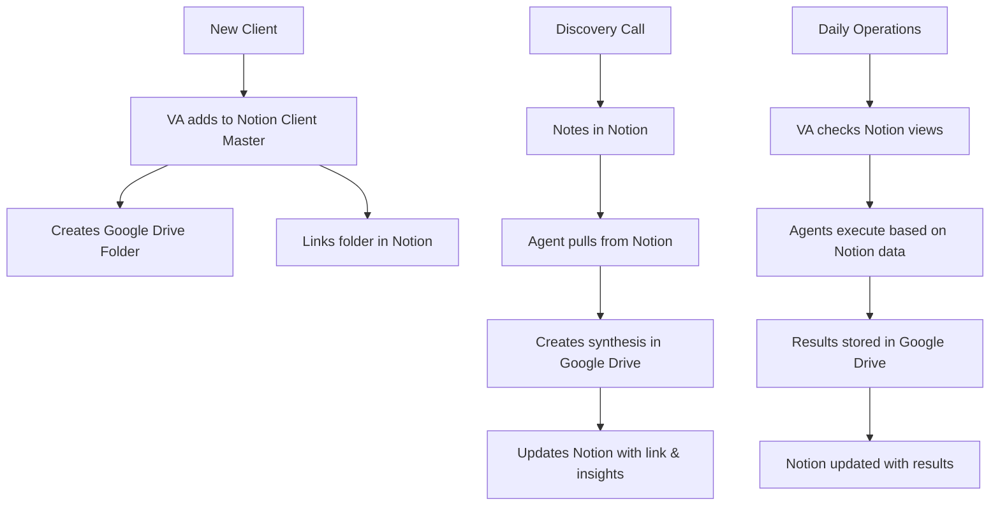

# Notion Operational Layer Setup
## Adding Intelligence Without Disrupting Google Drive

---

## What We're Building in Notion

### This is PURELY OPERATIONAL - Your Google Drive System Remains Untouched

**Google Drive** = System documentation, files, deliverables ✅ (NO CHANGES)
**Notion** = Live operational data, client tracking, agent memory 🆕 (NEW ADDITION)

---

## Step 1: Create Your Notion Structure (30 minutes)

### Create These 6 Databases in Notion:

#### 1️⃣ Client Master Database
```
Page Name: "🏢 Client Master"
Database Type: Table

Properties to Add:
- Company Name (Title)
- Contact Name (Text)
- Email (Email)
- Phone (Phone)
- Website (URL)
- Stage (Select): Lead, Discovery, Proposal, Client, Churned
- Package (Select): Growth, Leader, Domination
- Monthly Investment (Number)
- Health Score (Number 1-10)
- Last Contact (Date)
- Next Action (Text)
- Google Drive Folder (URL) ← Links to your existing folders!
- Discovery Notes (Relation) ← Links to Discovery database
- Agent Log (Relation) ← Links to Agent Executions
```

#### 2️⃣ Discovery Notes Database
```
Page Name: "📝 Discovery Notes"
Database Type: Table

Properties:
- Meeting Title (Title)
- Client (Relation to Client Master)
- Date (Date)
- Problems Identified (Multi-select)
- Goals (Multi-select)
- Budget Mentioned (Number)
- Key Insights (Text)
- Synthesis Complete (Checkbox)
- Google Doc Link (URL) ← Links to synthesis in Drive!
```

#### 3️⃣ Agent Execution Log
```
Page Name: "🤖 Agent Executions"
Database Type: Table

Properties:
- Execution ID (Title)
- Agent Name (Select): Discovery_Synthesizer, SOW_Generator, etc.
- Client (Relation to Client Master)
- Executed At (Date & Time)
- Status (Select): Success, Failed, Pending
- Execution Time (Number - seconds)
- Output Location (URL) ← Points to Google Drive!
- Insights Generated (Text)
```

#### 4️⃣ Pattern Library
```
Page Name: "🔍 Pattern Library"  
Database Type: Table

Properties:
- Pattern ID (Title)
- Pattern Type (Select): Problem, Opportunity, Process
- First Seen (Date)
- Times Encountered (Number)
- Clients Affected (Multi-relation to Client Master)
- Solution Applied (Text)
- Reusable (Checkbox)
```

#### 5️⃣ Task Queue
```
Page Name: "📋 Task Queue"
Database Type: Table

Properties:
- Task Name (Title)
- Client (Relation to Client Master)
- Assigned To (Person)
- Due Date (Date)
- Priority (Select): High, Medium, Low
- Status (Select): To Do, In Progress, Done
- Task Type (Select): Manual, Automated
- Related Agent (Select)
```

#### 6️⃣ Quick Metrics Dashboard
```
Page Name: "📊 Metrics"
Database Type: Gallery

Properties:
- Metric Name (Title)
- Current Value (Number)
- Target (Number)
- Period (Select): Daily, Weekly, Monthly
- Last Updated (Date)
```

---

## Step 2: Create Views for Easy Access (15 minutes)

### In Client Master, Create These Views:

#### "Pipeline View" (Kanban)
- Group by: Stage
- Sort by: Last Contact
- Show: Company, Investment, Health Score

#### "Active Clients" (Table)
- Filter: Stage = Client
- Sort by: Health Score (low to high)
- Show: All properties

#### "Needs Attention" (Table)
- Filter: Health Score < 7 OR Last Contact > 14 days ago
- Sort by: Health Score
- Show: Company, Health, Last Contact, Next Action

#### "My Clients" (Table)
- Filter: Owner = Me
- Sort by: Next Action Date
- Show: Company, Stage, Next Action

---

## Step 3: Set Up Notion API (10 minutes)

### Create Integration:
1. Go to: https://www.notion.so/my-integrations
2. Click "New Integration"
3. Name: "Sidekick Agent System"
4. Type: Internal
5. Capabilities: Check all (Read, Update, Insert)
6. Copy the Internal Integration Token (save securely!)

### Share Databases with Integration:
1. Open each database page
2. Click "..." menu → "Add connections"
3. Search for "Sidekick Agent System"
4. Click to add
5. Repeat for all 6 databases

### Get Database IDs:
1. Open each database
2. Copy URL - looks like: notion.so/workspace/abc123xyz...
3. The ID is the string before the "?v="
4. Save these IDs:
```yaml
client_master_id: "xxxxx"
discovery_notes_id: "xxxxx"
agent_executions_id: "xxxxx"
pattern_library_id: "xxxxx"
task_queue_id: "xxxxx"
metrics_id: "xxxxx"
```

---

## Step 4: Connect to Make.com (15 minutes)

### In Make.com:
1. Create New Scenario
2. Add Module: Notion → "Search Objects"
3. Create Connection:
   - Connection name: "Sidekick Notion"
   - Token: [Your Integration Token]
4. Test with Client Master:
   - Database ID: [Your client_master_id]
   - Run once to verify connection

### Create Your First Integration:
```javascript
// When Discovery_Synthesizer runs:
1. Search Notion for Client (by name)
2. Get client data
3. Run synthesis
4. Create Google Doc (in Drive)
5. Update Notion with:
   - Link to Google Doc
   - Key insights found
   - Execution logged
```

---

## Step 5: Standard Operating Procedures

### For You:
```markdown
Daily:
1. Check "Needs Attention" view in Client Master
2. Review Agent Execution Log for failures
3. Check Pattern Library for new patterns

Weekly:
1. Review Pipeline View
2. Update Health Scores
3. Archive completed tasks
```

### For Your VA:
```markdown
When New Lead Comes In:
1. Add to Client Master in Notion
2. Set Stage = "Lead"
3. Create Google Drive folder
4. Link folder URL in Notion

After Discovery Call:
1. Create entry in Discovery Notes
2. Link to Client Master
3. Check "Synthesis Complete" when agent runs
4. Update Client Stage

Daily:
1. Check Task Queue for assignments
2. Update Client Last Contact dates
3. Monitor "Needs Attention" view
```

### For Agents (Automated):
```markdown
Every Agent Execution:
1. Log start in Agent Executions
2. Pull client data from Notion
3. Execute core function
4. Save output to Google Drive
5. Update Notion with:
   - Execution complete
   - Output location
   - Any patterns found
```

---

## The Data Flow (How It All Works)



---

## What This Gives You

### Immediate Benefits:
1. **VA Efficiency**: Find any client in 2 seconds
2. **Pipeline Visibility**: See all deals at a glance
3. **Pattern Detection**: Spot trends across clients
4. **Agent Memory**: System learns and improves
5. **No Disruption**: Google Drive unchanged

### Search Examples in Notion:
- "Show all clients in proposal stage"
- "Which clients haven't been contacted this week?"
- "What patterns have we seen with landscaping companies?"
- "Which agents ran today?"
- "Show all high-priority tasks"

### This is IMPOSSIBLE with just Google Drive

---

## Testing Your Setup

### Quick Test Flow:
1. Add a test client to Client Master
2. Create a discovery note linked to them
3. Use Make.com to:
   - Read the client data
   - Create a test document
   - Update Notion with result
4. Verify everything connects

### Success Looks Like:
- ✅ Client data easily searchable
- ✅ VA can update from phone
- ✅ Agents can read/write via API
- ✅ You can see everything in one place
- ✅ Google Drive still handles all files

---

## Remember: This ADDS to Your System

**Your Google Drive setup**: Perfect as-is for documentation and files
**Your new Notion layer**: Adds operational intelligence and searchability

They work together:
- Notion tracks WHO, WHAT, WHEN, STATUS
- Google Drive stores the actual FILES
- Make.com connects everything

---

## Next Steps:

1. **Create the 6 databases** (30 min)
2. **Set up the views** (15 min)
3. **Get API token** (10 min)
4. **Test with Make.com** (15 min)

Total: 1 hour to add operational intelligence to your system!

**This preserves everything you built while adding massive operational power!**